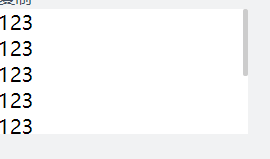

# h-plugins (vue)
欢迎阅读 [GitHub源码](https://github.com/hejianfang/plugins "hejianfang")

## h-plugins

```
自己的插件库，封装一些项目中遇到比较多的组件或者方法，
1，自适应tab切换
2，表格table单选与反选
3，pdf 导出的方法
4，table 导出 xlsx 的方法
5，pc端瀑布流布局计算方法
6，自定义指令
7，多浏览器滚动条样式优化
```

## 安装

```
yarn add h-plugins
npm i h-plugins
```

## 项目引入

```
入口文件引入
import HPlugins from "h-plugins";
import "h-plugins/dist/h-plugin.css";
Vue.use(HPlugins)
```

## 页面使用 tab 切换

```
<h-tabs v-model="active" :tabList="list"></h-tabs>
```
## 表格table单选与反选
isSelection是否显示复选框
handleSelectionChange 返回选中的一行数据
```
    <h-hTable
      :data="list"
      :thData="['标题']"
      :tdData="['name']"
      :isSelection="true"
      @selection-change="handleSelectionChange"
    ></h-hTable>
```

## pdf 导出的方法

```
<button @click="$exportSavePdf('标题')">导出</button>
<div id="pdfContent">
   123
</div>
$exportSavePdf 是导出pdf的内置方法（需要传入一个导出pdf的文件名）
id = pdfContent 是导出的dom是必填项，不写会出错
```

## table 导出 xlsx 的方法

```
<button @click="$exportTable('表格名称', [100], 10)">导出表格</button>
<table class="common-table" id="table">
   <tr>
     <th>序号</th>
   </tr>
   <tr>
     <td>1</td>
   </tr>
</table>
$exportTable 接收三个参数，导出表格的名称，每列的宽度，以及多少列

默认名字是‘模板’，默认列数为10列，每列宽度默认200px。

id = table 是导出的dom是必填项。

如果有需要隐藏的单元格，在这个单元格加 class="none", 导出的表格会隐藏该单元格
```

## pc端瀑布流布局计算方法
```
html部分 示例
    <div id="waterWrap">
      <div class="waterWrap" :style="{ width: waterWidth }">
        <ul v-for="(w, i) in waterList" :key="i">
          <li v-for="(item, index) in w" :key="index">{{ item.name }}</li>
        </ul>
      </div>
    </div>
js部分  示例
    data() {
        return {
          waterList: [],
          waterWidth: null
        };
      },
      mounted() {
        const list = [
          { name: "1" },
          { name: "2" },
          { name: "3" },
          { name: "4" },
          { name: "5" }
        ];
        this.$waterFall(list, this);
      },
css部分 示例
      .waterWrap{
          margin: 0 auto;
          display: flex;
          justify-content: space-between;
          ul {
            width: 374px;
            li{
              margin-top: 20px;
              height: 100px;
              line-height: 100px;
              border: @border-d;
            }
          }
        }
```
****
## 自定义指令
```
复制粘贴指令 v-copy
<template>
  <button v-copy="copyText">复制</button>
</template>
<script> export default {
    data() {
      return {
        copyText: 'a copy directives',
      }
    },
  }
</script>
```
```
长按指令 v-longpress
<template>
  <button v-longpress="longpress">长按</button>
</template>
<script> 
export default {
  methods: {
    longpress () {
      alert('长按指令生效')
    }
  }
} 
</script>
```
```
输入框防抖指令 v-debounce
<template>
  <button v-debounce="debounceClick">防抖</button>
</template>

<script> 
export default {
  methods: {
    debounceClick () {
      console.log('只触发一次')
    }
  }
} 
</script>
```
```
禁止表情及特殊字符 v-emoji
<template>
  <input type="text" v-model="note" v-emoji />
</template>
```
```
图片懒加载 v-LazyLoad

```
```
权限校验指令 v-premission
<div class="btns">
  <!-- 显示 -->
  <button v-permission="'1'">权限按钮1</button>
  <!-- 不显示 -->
  <button v-permission="'10'">权限按钮2</button>
</div>
```
```
实现页面水印 v-waterMarker
<template>
  <div v-waterMarker="{text:'lzg版权所有',textColor:'rgba(180, 180, 180, 0.4)'}"></div>
</template>
```
```
拖拽指令 v-draggable
<template>
  <div class="el-dialog" v-draggable></div>
</template>
```

## 多浏览器滚动条样式优化

```
 <h-hScroll color="rgba(0,0,0,0.2)">
  <div>
    <p>123</p>
    <p>123</p>
    <p>123</p>
    <p>123</p>
    <p>123</p>
    <p>123</p>
    <p>123</p>
    <p>123</p>
    <p>123</p>
  </div>
  </h-hScroll>
```